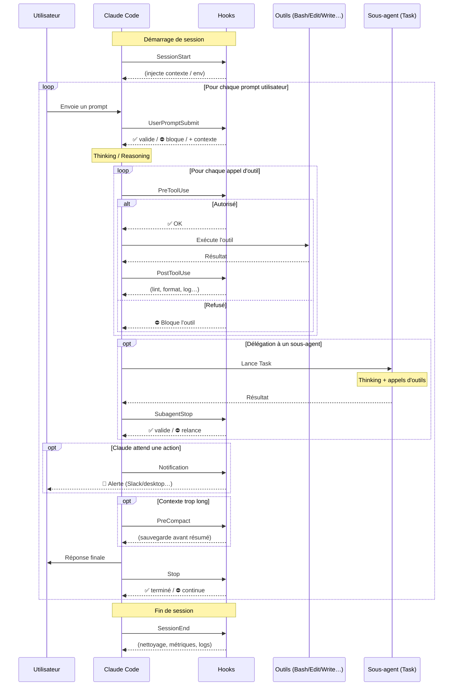

# Les Hooks de Claude Code

Ce document décrit les différents types de hooks disponibles dans Claude Code,
le moment où ils sont déclenchés, et un cas d'usage concret pour chacun.

---

## Tableau des hooks

| Hook | Quand il se déclenche | Peut bloquer ? | Exemple d'usage |
|------|----------------------|:---:|-----------------|
| **SessionStart** | Au démarrage d'une session (ou reprise) | Non | Charger le contexte projet, injecter des infos d'environnement |
| **UserPromptSubmit** | Quand l'utilisateur envoie un prompt, *avant* que Claude le traite | ✅ Oui | Valider/filtrer le prompt, ajouter du contexte, bloquer un mot-clé interdit |
| **PreToolUse** | *Avant* l'exécution d'un outil (Bash, Edit, Write…) | ✅ Oui | Refuser un `rm -rf`, demander confirmation, vérifier une autorisation |
| **PostToolUse** | *Après* l'exécution réussie d'un outil | Non | Lancer un linter/formatter après un Edit, logger les modifications |
| **Notification** | Quand Claude envoie une notification (attente d'input, permission) | Non | Envoyer une alerte Slack/desktop quand Claude attend une réponse |
| **Stop** | Quand Claude termine sa réponse principale | ✅ Oui | Forcer Claude à continuer, vérifier que la tâche est complète |
| **SubagentStop** | Quand un sous-agent (Task) termine | ✅ Oui | Valider le résultat d'un sous-agent avant de le remonter |
| **PreCompact** | Avant la compaction du contexte | Non | Sauvegarder l'historique avant résumé |
| **SessionEnd** | À la fin de la session | Non | Nettoyage, sauvegarde de logs, métriques |

> **Note pédagogique** — Certaines entrées vues dans des schémas de présentation
> ne correspondent pas à de vrais hooks Claude Code :
> - « Subagent Start » n'existe pas ; seul **SubagentStop** existe.
> - « ErrorOccured » n'est pas un hook dédié ; la gestion d'erreur passe par les
>   codes de sortie des autres hooks (ex. `PreToolUse` qui bloque).
> - Le vrai nom de « UserPromptSubmitted » est **UserPromptSubmit**.

---

## Diagramme de séquence



---

## Ordre d'appel (vue simplifiée)

```
SessionStart
   └─ (boucle prompt)
        UserPromptSubmit
           └─ (boucle outils)
                PreToolUse → [outil] → PostToolUse
           └─ SubagentStop      (si sous-agent)
           └─ Notification      (si attente)
           └─ PreCompact        (si contexte plein)
        Stop
SessionEnd
```

Les hooks **⛔** (`UserPromptSubmit`, `PreToolUse`, `Stop`, `SubagentStop`)
peuvent **interrompre/bloquer** le flux via leur code de sortie.
